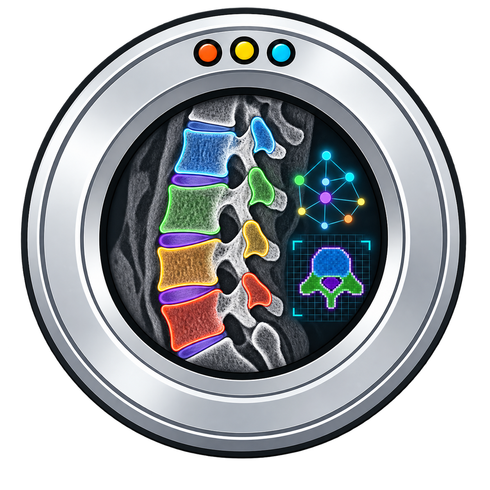

# spine-segment

<p align="center">
  
</p>

`spine-segment` is a lightweight command-line tool for vertebral CT
segmentation. It provides a native PyTorch implementation of the coarse-to-fine
vertebra localization, identification, and segmentation approach described by
Payer et al. (VISAPP/VISIGRAPP 2020), with additional vertebral body/process
and cortical/trabecular compartment outputs for quantitative spine analysis.

The package is designed for simple local use:

```bash
spine-segment image.nii.gz --output ./segmentation
```

It reads and writes NIfTI images with SimpleITK, uses PyTorch for inference, and
automatically selects `cuda`, `mps`, or `cpu` when `--device auto` is used.

## Outputs

For each input CT volume, the default command writes:

- `*_vertebral-level.nii.gz`: vertebra instance labels using VerSe vertebral
  level IDs, e.g. `20` is L1
- `*_process-body.nii.gz`: posterior process versus vertebral body labels,
  where `1` is posterior processes and `2` is vertebral body
- `*_cort-trab.nii.gz`: cortical versus trabecular compartment labels, where
  `1` is cortical bone and `2` is trabecular bone
- `*_centroids.json`: vertebral centroids in the original input scan grid

Two reduced-output modes are available:

- `--level-only`: writes `*_vertebral-level.nii.gz` and `*_centroids.json`
- `--localization-only`: writes only `*_centroids.json`

`--level-only` can consume a centroid artifact produced by
`--localization-only`, skipping the localization models:

```bash
spine-segment image.nii.gz --output ./segmentation --level-only \
  --centroids ./localization/image_centroids.json
```

The centroid artifact must describe the same CT geometry and can only be used
with one input CT. Stable fields from each supplied centroid, including the
localization score, are retained in the resulting centroid JSON.

The centroid JSON is keyed by vertebral label. For example, label `20`
corresponds to L1 in the VerSe convention used by this model:

```json
{
  "20": {
    "label": 20,
    "index": 19,
    "voxel_xyz": [264.77, 206.40, 95.50],
    "physical_xyz": [17.75, 45.77, -235.56],
    "voxel_count": 18422,
    "source": "segmentation"
  }
}
```

`voxel_xyz` is reported in the original input scan coordinate grid.
In `--localization-only` mode, centroids are generated directly from the
localization model and include a model response score.

## Label Reference

### `*_vertebral-level.nii.gz`

The vertebral-level output uses the VerSe vertebral label convention:

| Label | Anatomy |
| ---: | --- |
| `0` | Background |
| `1`-`7` | C1-C7 |
| `8`-`19` | T1-T12 |
| `20`-`25` | L1-L6 |
| `28` | Sacrum, when detected |

For example, `20` corresponds to L1.

### `*_process-body.nii.gz`

The process/body output is a binary compartment relabeling inside the vertebral
segmentation:

| Label | Anatomy |
| ---: | --- |
| `0` | Background |
| `1` | Posterior processes |
| `2` | Vertebral body |

### `*_cort-trab.nii.gz`

The cortical/trabecular output is derived from the vertebral-level segmentation
and CT intensities:

| Label | Anatomy |
| ---: | --- |
| `0` | Background |
| `1` | Cortical compartment |
| `2` | Trabecular compartment |

### `*_centroids.json`

The centroid JSON is keyed by the same vertebral labels as
`*_vertebral-level.nii.gz`. Each entry contains:

| Field | Meaning |
| --- | --- |
| `label` | Vertebral label value, e.g. `20` for L1 |
| `index` | Internal model index for that label |
| `voxel_xyz` | Continuous centroid index in original input voxel coordinates |
| `physical_xyz` | Centroid physical coordinate from the input image geometry |
| `voxel_count` | Number of voxels for segmentation-derived centroids |
| `score` | Localization model response, only for `--localization-only` |
| `source` | Centroid source, usually `segmentation` in normal mode |
| `segmentation_status` | `segmented` or `missing` when `--centroids` supplies the landmark |

## Installation

Install from PyPI:

```bash
python3 -m pip install spine-segment
```

The first segmentation run downloads the model bundle from the
`spine-segment` GitHub Releases page into the local user cache, verifies the
checkpoint SHA256 hashes, and reuses that cached bundle on later runs.

To disable the automatic download on offline or managed systems:

```bash
spine-segment image.nii.gz --output ./segmentation --no-model-download
```

or set:

```bash
export SPINE_SEGMENT_NO_DOWNLOAD=1
```

To use a manually staged bundle:

```bash
export SPINE_SEGMENT_MODEL_BUNDLE=/path/to/model-bundle
```

or pass it directly:

```bash
spine-segment image.nii.gz --output ./segmentation --model-bundle /path/to/model-bundle
```

For editable development installs, the model weights are stored with Git LFS.
Install Git LFS before cloning, or run `git lfs pull` after cloning if the
weights were not downloaded.

```bash
git lfs install
git clone https://github.com/wallematthias/spine-segment.git
cd spine-segment
git lfs pull
python3 -m pip install -e .
```

The runtime Python dependencies are intentionally small:

- `torch`
- `numpy`
- `SimpleITK`

On macOS, the default PyPI PyTorch package supports CPU and Apple MPS on
compatible machines. On CUDA systems, install the PyTorch build that matches
your CUDA runtime before installing `spine-segment`; see the PyTorch install
selector at <https://pytorch.org/get-started/locally/>.

If Git LFS did not fetch correctly, files in
`build/model-bundle-pytorch/weights/` will be small text pointer files instead
of PyTorch checkpoint files. Run:

```bash
git lfs pull
```

The development checkout model bundle is expected at:

```text
build/model-bundle-pytorch/
  manifest.json
  weights/
    spine-locator.pt
    vertebra-locator.pt
    vertebra-segmenter.pt
    process-body-segmenter.pt
```

## Command Line Usage

Segment one scan:

```bash
spine-segment image.nii.gz --output ./segmentation
```

Segment multiple scans:

```bash
spine-segment *.nii.gz --output ./segmentation
```

Write only vertebral-level labels:

```bash
spine-segment image.nii.gz --output ./segmentation --level-only
```

Write vertebral-level labels from an existing centroid artifact without
running localization:

```bash
spine-segment image.nii.gz --output ./segmentation --level-only \
  --centroids ./localization/image_centroids.json --device cpu --overwrite
```

Write only vertebral centroids from the localization model:

```bash
spine-segment image.nii.gz --output ./segmentation --localization-only
```

Select a device explicitly:

```bash
spine-segment image.nii.gz --output ./segmentation --device cuda
spine-segment image.nii.gz --output ./segmentation --device mps
spine-segment image.nii.gz --output ./segmentation --device cpu
```

## Implementation Notes

The vertebral-level model follows a three-stage coarse-to-fine pipeline:

1. Spine localization at coarse resolution.
2. Vertebra centroid localization and identification.
3. Per-vertebra segmentation from 1 mm isotropic patches.

For long whole-body CT scans whose superior-inferior extent exceeds the coarse
spine localizer field of view, the implementation evaluates overlapping
localizer windows along z and selects the candidate whose downstream vertebra
localization yields the strongest/most landmarks. Output metadata records the
number of spine-localizer tiles and the selected tile.

The implementation in this repository is native PyTorch and does not require
TensorFlow or nnU-Net at runtime. The process/body segmentation network is
loaded directly from a PyTorch checkpoint using a minimal in-repository model
definition.

The cortical/trabecular compartment output is derived from the vertebral-level
segmentation and CT intensities. It covers every labeled vertebra in the
vertebral-level map. The current post-processing keeps the outer surface
constrained to the vertebral labelmap, assigns a minimum one-voxel cortical
outline, and allows connected high-density cortical extension within a 6 mm
shell.

## Citations

If you use this package, please cite the underlying methods:

```text
Payer C, Štern D, Bischof H, Urschler M.
Coarse to Fine Vertebrae Localization and Segmentation with
SpatialConfiguration-Net and U-Net.
In: Proceedings of the 15th International Joint Conference on Computer Vision,
Imaging and Computer Graphics Theory and Applications (VISIGRAPP 2020),
Volume 5: VISAPP. 2020;124-133.
doi:10.5220/0008975201240133
```

```text
Walle M, Matheson BE, Boyd SK.
Comparing linear and nonlinear finite element models of vertebral strength
across the thoracolumbar spine: a benchmark from density-calibrated computed
tomography.
GigaScience. 2025;14:giaf094.
doi:10.1093/gigascience/giaf094
PMID:40880132
```

## Development

Run the test suite with:

```bash
python3 -m pip install -e ".[test]"
python3 -m pytest tests -q
```

The repository also includes utilities for staging model bundles and converting
the original TensorFlow checkpoints into PyTorch state dictionaries:

```bash
python3 scripts/stage_model_bundle.py --help
python3 scripts/convert_mdat_tf_checkpoints.py --help
```
